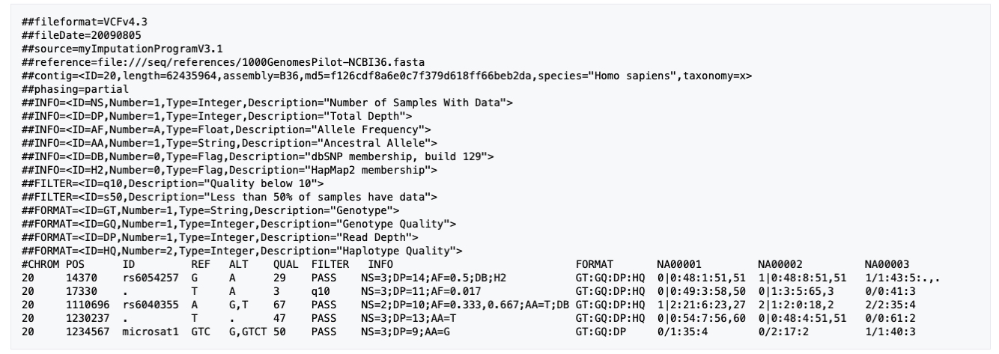

#NGS Bioinformatics
##Pathogen variant calling practical assignment

- Module topic: Pathogen variant calling 
- Contact session title: Day1
- Trainer: Narender, Jon
- Participant: <write your name here> 
- Date: <write today’s date here>

### Reference mapping and variant calling: Pathogens 
####Introduction
All information is found in practical material. We will use this document to answer the questions.

**Please note**

Hand-in information please upload your completed assignment to the Vula ‘Assignments’
tab. Take note of the final hand-in date for each assignment, which will be indicated on Vula.

####Session 1: Reference mapping
**Q1.1:** How many read pairs were assigned as duplicates?

(start typing your answer here)

**Q1.2:** What proportion of the mapped sequence was marked as duplicates? 

(start typing your answer here)

**Q1.3:** What is the total number of mapped reads?

(start typing your answer here)

**Q1.4:** What is the total number of unmapped reads?

(start typing your answer here)

**Q1.5:** What is the total number of mapped and properly paired reads? 

(start typing your answer here)

**Q1.6:** What is the average insert size?

(start typing your answer here)

Q1.7:What is the percentage of reads properly paired? 

####Session 2: Variant Calling and annotation
Q2.1: At what position is the first variant in the unfiltered vcf file for MD001?

(start typing your answer here)

Q2.2: What does the DP4 value represent?

(start typing your answer here)

Q2.3: What is the read depth of the variant with an ID = rs6040355 for sample NA00002?

(start typing your answer here)

Q2.4: What is the probability that a variant with a GQ of 23 is not a true variant?

(start typing your answer here)

Q2.5: How many HIGH effect variants were there for sample MD001?

(start typing your answer here)

Q2.6: What was the TS TV ratio? (Look in the MD001_snpEff.csv summary file)

(start typing your answer here)

Q2.7: Are there any other mutations in resistance related genes?

| Isolate | Gene | Drug            | Mutation                         | Position | Genotype (R/S) |
|---------|------|-----------------|----------------------------------|----------|----------------|
| MD001   | rpoB | RIFAMPICIN      | Ser450X (S450X), Asp435X (D435X) | 761110   | R (D435X)      |
| MD001   | rpsL | STREPTOMYCIN    |                                  |          |                |
| MD001   | gyrA | FLUOROQUINOLONE |                                  |          |                |
| MD001   | katG | ISONIAZID       |                                  |          |                |