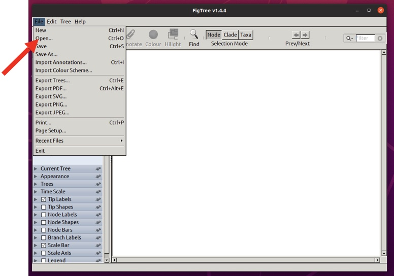
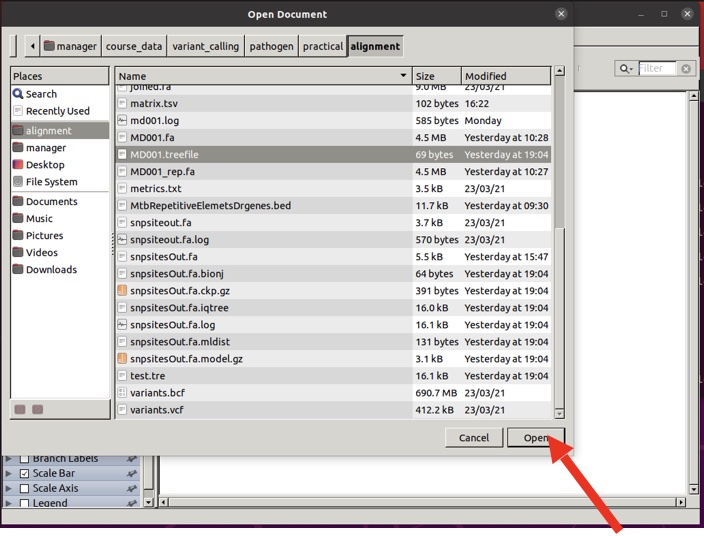
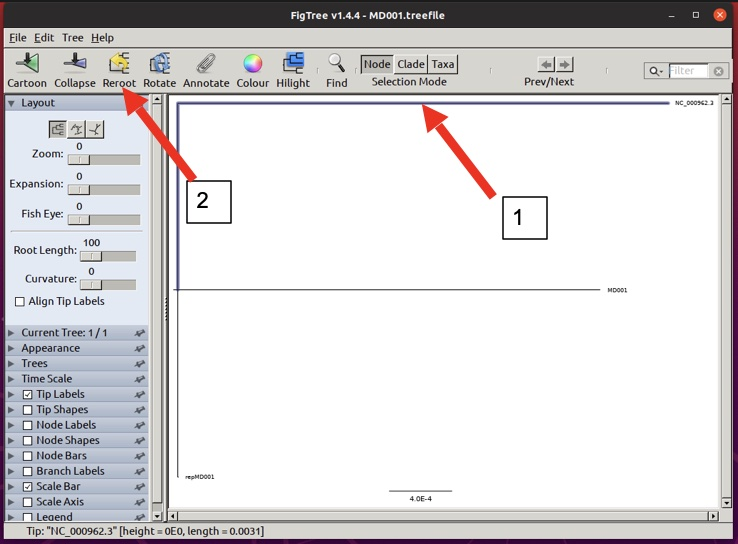

#Module 6: Pathogen Variant Calling
##Day 2, practical session 3: Trees and comparisons 

### Introduction
In this module we will be analyzing the case of four Mycobacterium tuberculosis isolates (3 multi-drug resistant and 1 susceptible) from TB patients to investigate following aspects from whole genome sequence data:
- Genetic mechanisms of resistance 
- Identify resistance to other anti-Tb drugs
- Determine the genetic relatedness (pairwise SNP difference)
- Understand their phylogenetic relationship 

To answer each of these questions we will first perform the analysis on one isolate and the steps would be repeated for others as part of the assignment. 

Today we will try and answer the last two questions from above. Before we jump into the steps for analysis, we need to make sure we have all the required tools/softwares installed and a dataset in one place. Follow the following steps:
1. Open the Terminal and determine the current working directory
    - ```pwd```
2. Go to the folder "practical"
    - ```cd course_data/variant_calling/pathogen/practical/MD001```
3. To ensure the tools are installed properly the following commands when typed in the terminal must not generate any error. The command figtree will open another window, please close it we will require this later in the practical.
    - ```
      bcftools
      snp-sites -h
      snp-dists -h
      iqtree -h
      figtree
      ```

### Inferring genetic relatedness

1. Create a zipped file of the high-quality variants identified in session 2, question 7 of the practical exercises you did on day 1.
    - ```bcftools view -O z -o MD001_filtered.vcf.gz MD001_SNPs_filtered.vcf```
    - ```bcftools index MD001_filtered.vcf.gz```
2. Generating pseudogenome
   - ```bcftools consensus -f reference.fa MD001_filtered.vcf.gz > MD001_consensus.fa```
3. Renaming the pseudogenome
   - ```sed 's|^>.*|>MD001|' MD001_consensus.fa >MD001_pseudogenome.fa```
4. Filter all high quality homozygous SNPs removing those in repetitive regions (file: MtbRepetitiveElemetsDrgenes.bed )
   - ```cp ../../dataset/MtbRepetitiveElemetsDrgenes.bed ./```
   - ```bcftools filter -T MtbRepetitiveElemetsDrgenes.bed -i 'type="snp" && QUAL>=50 && FORMAT/DP>5 && MQ>=30 && DP4[2]/(DP4[2]+DP4[0])>=0.80 && DP4[3]/(DP4[3]+DP4[1])>=0.80' -g10 -G10 MD001_variants.vcf -o MD001_SNPs_repfiltered.vcf```
5. create a zipped file of the high-quality variants
   - ```bcftools view -O z -o MD001_repfiltered.vcf.gz MD001_SNPs_repfiltered.vcf```
   - ```bcftools index MD001_repfiltered.vcf.gz```
6. Generate pseudogenome
   - ```bcftools consensus -f reference.fa MD001_repfiltered.vcf.gz > MD001_repfiltered_consensus.fa```
7. Renaming the pseudogenome
   - ```sed 's|^>.*|>MD001_repfiltered|' MD001_repfiltered_consensus.fa >MD001_repfiltered_pseudogenome.fa```
8. Now we have two pseudogenomes for MD001 isolates:
   - `MD001_pseudogenome.fa` : It has all the SNPs identified including those in repetitive regions
   - `MD001_repfiltered_pseudogenome.fa` : It has all the SNPs excluding those identified in repetitive regions
9. Concatenate the files
   - ```cat reference.fa MD001_pseudogenome.fa MD001_repfiltered_pseudogenome.fa >concatenated_alignment.fa```
10. Identifying the variable sites (snp-sites) only
    - ```snp-sites -o snpsitesOut.fa concatenated_alignment.fa```
    - You can determine the length of the alignment using the following bash command:
    - ```sed -n ‘2p’ snpsitesOut.fa | wc```
    - In the above command `-n` allows printing lines, `2p` states 2<sup>nd</sup> line to print and `wc` counts the words in the line

**Q3.1:** What is the length of the alignment in “snpsitesOut.fa” file?

11. Identifying the pairwise genetic distance (pairwise SNPs) among the three pseudogenomes
   - ```snp-dists snpsitesOut.fa >matrix.tsv```

**Q3.2:** What is the pairwise SNP difference between the following pairs: MD001-- repMD001 and NC00962.3 – repMD001?

12. Creating a phylogenetic tree
   - ```iqtree -s snpsitesOut.fa >tree1.log```
13. Rename the file `snpsitesOut.fa.treefile` just created
   - ```mv snpsitesOut.fa.treefile MD001.treefile```

### Visualization of the tree

14. In the terminal type the command:
   - ```figtree```
15. This will open a new window as shown below


16. Open the tree file created in step 3.14 by clicking on the file tab on the top left corner and selecting the option “Open” (figure2). This will open another window, go to the “practical” folder where you have the tree file and load it in FigTree by clicking on “open” tab as shown in figure3.





17. Now you will be able to see the midpoint rooted phylogeny with three tips. Select the branch of NC_000962.3 (arrow 1) and then click on “reroot” (arrow 2) option on the top.	



18. This is the final phylogenetic tree. The horizontal branches show the number of differences (longer the branch more are the SNPs for a particular isolate/strain). The two pseudogenomes that we created in this practical for isolates MD001 are closely related compared to reference. The branch of MD001 is longer than repMD001, guess why?


### Assignment
Now that we have learnt the process of mapping to a reference, variant calling, variant filtering, pseudogenome creation, determination of pairwise SNP difference and creating a phylogenetic tree. Your next exercise would be to run the same series of steps for the other three isolates (MD003, MD012, MD024) to create pseudogenomes and then create a phylogenetic tree of the isolates (reference, MD001, MD003, MD012 and MD024) along with reference. 

The sequence reads for the three isolates are in `course_data/variant_calling/pathogen/dataset` folder.

Please follow the following steps:

1. Create separate folders for each of the three isolates

2. Follow the steps until 3.9 (both day1 and Day2 practicals) in order to create pseudogenomes (using the repfiltered SNPs: step: 3.5) for each of the three isolates in the manual

3. Step 3: Concatenate the pseudogenomes of all 4 isolates together with the reference as per step 3.10, for example:
   - ```cat reference.fa MD001_ repfiltered_pseudogenome.fa MD003_ ```
   - ```repfiltered_pseudogenome.fa MD012_ repfiltered_pseudogenome.fa MD024_ ```
   - ```repfiltered_pseudogenome.fa > combined_aln.fa```
4. Follow the steps 3.11 to 3.19 to create the phylogenetic tree.

Once you have completed the steps above answer the following questions and submit it to vula.

**Q3.3:** What is the pairwise SNP difference for following pairs:

a) MD001-MD003:   		
b) MD012-MD024:   	
c) MD003-MD012:    	
d) MD001-MD024:

**Q3.4:** Report the resistance conferring variant identified for the following isolate drug combination: (record the position/coordinate and the mutation identified in the cases where isolates are resistant)

| Isolate | Gene | Drug            | Position | Genotype (R/S) |
|---------|------|-----------------|----------|----------------|
| MD003   | katG | Isoniazid       |          |                |
| MD003   | rpsL | Streptomycin    |          |                |
| MD012   | rpoB | Rifampicin      |          |                |
| MD012   | gyrA | Fluoroquinolone |          |                |
| MD024   | katG | Isoniazid       |          |                |
| MD024   | rpsL | Streptomycin    |          |                |
| MD024   | rpoB | Rifampicin      |          |                |
| MD024   | gyrA | Fluoroquinolone |          |                |


End.


