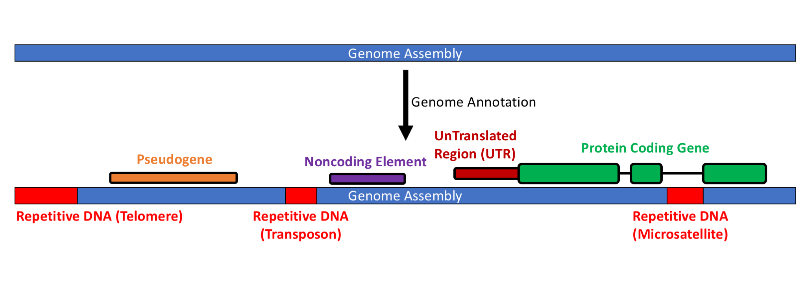
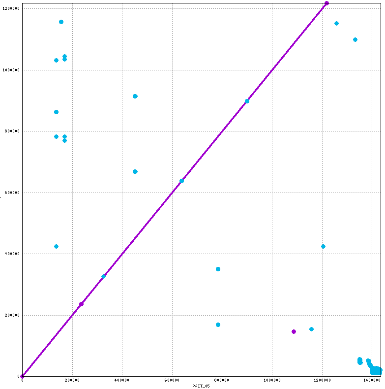
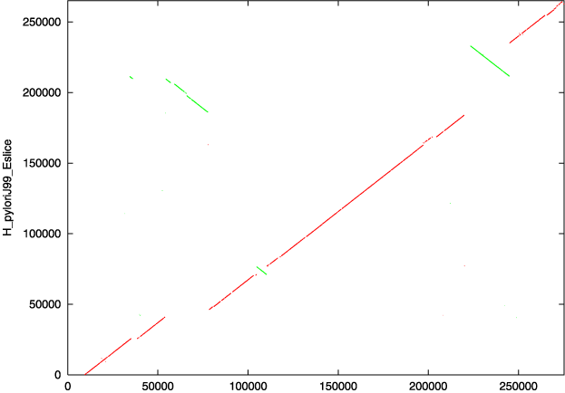
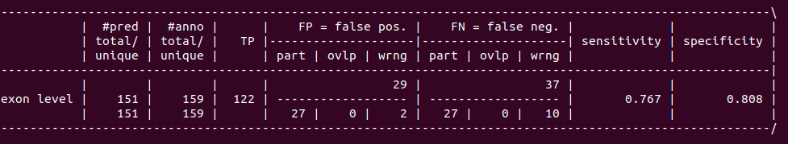
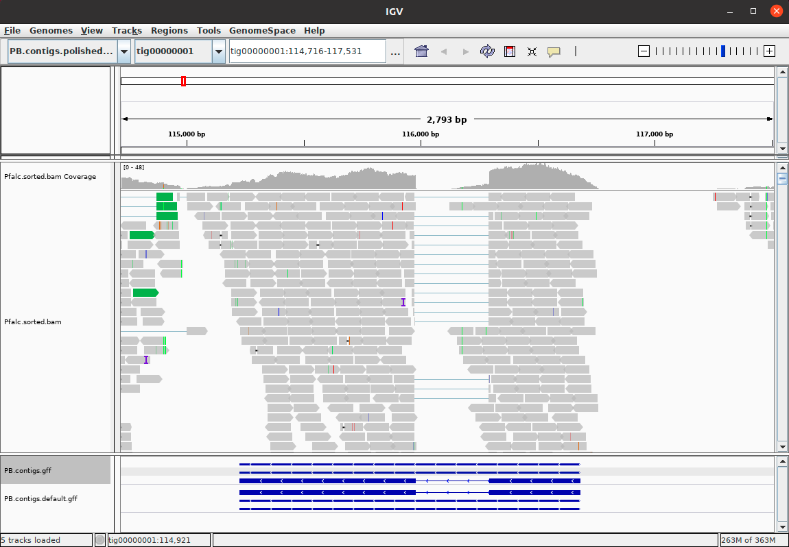
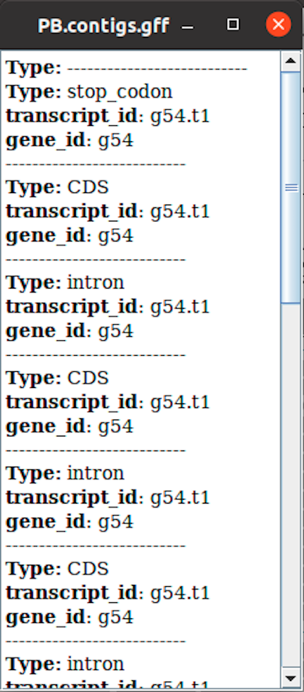
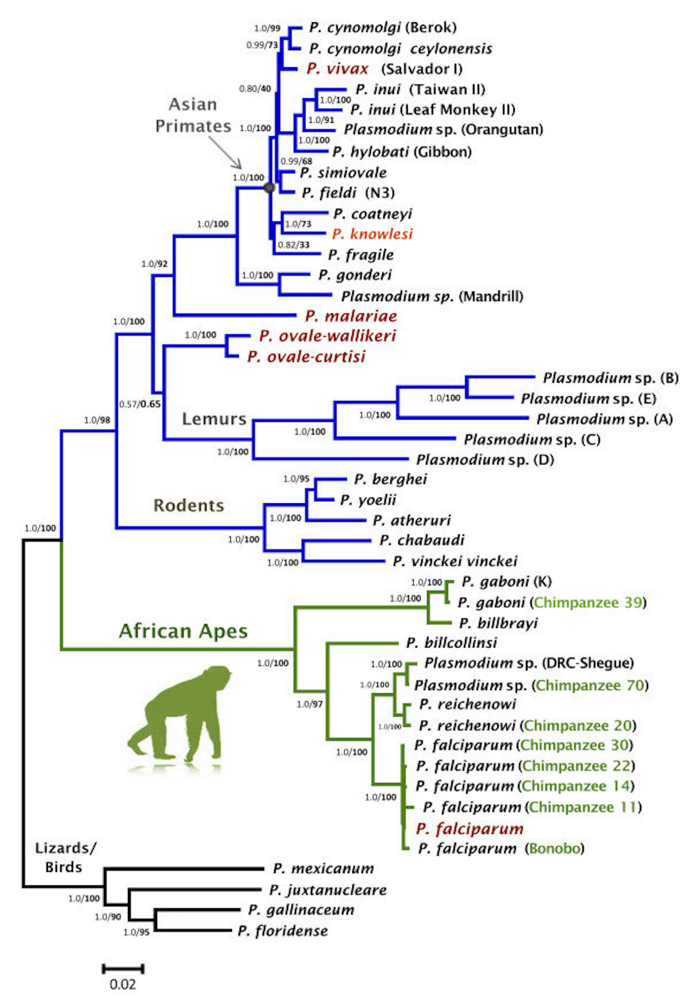
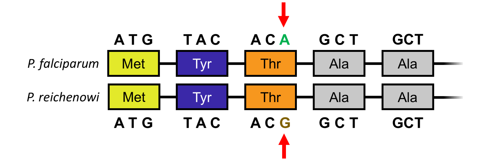
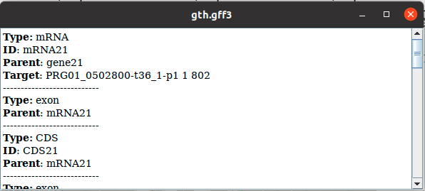

# 1. Genome Annotation

## 1.1 Introduction

During the last practical assignment (Genome Assembly), we generated an assembly of chromosome 5 of the eukaryotic intracellular parasite
_Plasmodium falciparum_. Today we are going to use our assembly to learn about how to compare different genome assembly versions and
identify sequences that may have some biological function. This process is known as "Genome Annotation" and is
graphically represented below:



Genome Annotation is about taking a raw assembled genome (top; like the one you created in the "Assembly" module) and
annotating it with features that biologists are interested in (bottom). While we will not be annotating all the features outlined
above today, this schematic should give you a general ideal of what this practical is about.

## 1.2 Learning Outcomes

On completion of the tutorial, you can expect to be able to:

* Align two different reference genome assemblies against one another.
* Identify repetitive DNA sequences.
* Align RNA-seq data to an assembly and use it to identify genes.
* Use comparative genomics to identify similar proteins in other organisms.

## 1.3 Tutorial sections

This tutorial comprises the following sections:

1. [Comparing Reference Genomes](reference_alignment.ipynb)
2. [Identifying repetitive DNA](repetitive_dna.ipynb)
3. [Gene Discovery](gene_discovery.ipynb)
4. [Gene Annotation using Comparative Genomics](comparative_genomics.ipynb)

## 1.4 Authors

This tutorial was written by [Eugene Gardner](https://github.com/eugenegardner).

## 1.5 Running the commands from this tutorial

You can follow this tutorial by typing all the commands you see into a terminal window. This is similar to the “Command Prompt” window on MS Windows systems, which allows the user to type DOS commands to manage files.

To get started, open a new terminal window and type the command below:

> ```commandline
> cd ~/course_data/annotation/data
> ```

## 1.6 Let's get started!

This tutorial requires that you have mummer, RepeatMasker, hisat2, samtools, augustus, and GenomeThreader installed
on your computer. These are already installed on the virtual machine you are using. To check that these are installed,
run the following commands:

> ```commandline
> nucmer
> RepeatMasker
> hisat2
> samtools
> augustus
> gth
> ```

This should return the help message for each of these programs. If you want to install this software yourself, please see the software websites:

* the [mummer](https://github.com/mummer4/mummer) website
* the [RepeatMasker](https://www.repeatmasker.org/) website
* the [hisat2](http://daehwankimlab.github.io/hisat2/) website
* the [samtools](http://www.htslib.org/) website
* the [augustus](https://github.com/Gaius-Augustus/Augustus) website
* the [GenomeThreader](https://genomethreader.org/) website

We also need to add custom scripts to our PATH environmental variable so that we can run them easily from the command-line. Run the following command:

> ```commandline
> export PATH=/home/manager/course_data/annotation/scripts/:$PATH
> ```

Now lets check that you can run the scripts we just added to the path:

> ```commandline
> computeFlankingRegion.pl
> augustus
> ```

Both of these commands should return help information for each program. If you get an error, close your terminal and
restart this tutorial.

Once you have confirmed that you can run all of the above commands, proceed to
[Comparing Reference Genomes](#2-comparing-reference-genomes).

<div style="page-break-after: always;"></div>

# 2. Comparing Reference Genomes

First, check you are in the correct directory.

> ```commandLine
> pwd
> ```

It should display something like:

`/home/manager/course_data/assembly/data`

So, we have done Pacbio and Illumina sequencing, and made a genome assembly - now what do we do? In many cases, researchers have previously performed
assemblies of a model organism, but these assemblies may be imperfect due to various factors. Our goal here is to
determine how our reference genome compares to a previous reference genome.

**Question:** Based on your work during the previous assembly module, can you think of a reason why assembly might not be perfect?

## 2.1 Set Up

We have already placed a copy of the assembly that you performed yesterday into your current working directory:

Do the following command to ensure that it is present:

> ```commandLine
> ls PB.contigs.polished.fasta
> ```

We first need to convert the header of this file to something that is easier for our tools to read:

> ```commandline
> { echo ">tig00000001"; tail -n+2 PB.contigs.polished.fasta; } \ 
>   > PB.contigs.polished.reheader.fasta
> ```

You can then run the following command to make sure that you have performed the formatting correctly:

> ```commandLine
> head PB.contigs.polished.reheader.fasta
> ```

should return something similar to:

    >tig00000001
    TCTTATCTTCTTACTCTTATCTTCTTACTTTTCATTTCTTAGTCTTACTTTCTTCTTCTT
    ATCTTCTTACTGTTATCTTCTTACTTTTCATTCCTTACTCTTACTTACTTACTCTTATCT
    TCTTACTTTTCATTCCTTAGTCTTACTTACTTACTCTTACTTTCTTCTTCTTATCTTCTT
    ACTCTTATCTTCTTACTTTTCATTACTTAGTCTTACTTACTTACTCTTACTTACTTACTC
    TTATCTTCTTACTTTTCATTCCTTACTCTTACTTACTTACTCTTATCTTCTTACTTTTCA
    TTCCTTACTCTTACTTTCTTCTTCTTAGGTCCTTACTTTTAACTTCTTATTCTTACTTTC
    TTACTCTTACGTCCTTACTCTTACTTACTTACTCTTATCTTCTTACTTTTCATTCCTTAC
    TTTTCATTCCTTACTTTTCATTTCTTCATCTTATCTTCTTACTTTTCATTCCTTACTCTT
    ACTTACTTACTCTTATCTTCTTACTTTTCATTTCTTAATCATATATTCTTACTCATATAC

Now index this file so that we can use it for other parts of this practical:

> ```commandLine
> samtools faidx PB.contigs.polished.reheader.fasta
> ```

If these commands did not work, there is a copy of `PB.contigs.polished.reheader.fasta` in `annotation_backups/`.

## 2.2 Visually Comparing Assemblies

Since we know from the Genome Assembly practical that our assembly was generated from sequencing chromosome 5 of a
_P. falciparum_ isolate, we can compare our results to a previously assembled version of the _P. falciparum_ genome. We
have pre-downloaded a version of the current _P. falciparum_ reference genome from [PlasmoDB](https://plasmodb.org) that only contains chromosome 5 and
placed it in your current directory. Run the following command to see what the first 10 lines of the file look like.

> ```commandLine
> head Pfalc_chr5_ref.fa
> ```

This should look similar to your own file that you assembled yesterday.

Next, we are going to use the tool `mummer` to align our assembly to the reference sequence of _P. falciparum_. Mummer
was developed to align entire bacterial genomes and is available on both [github](https://github.com/mummer4/mummer) and
through bioconda. We can align our assembly to the _P. falciparum_ reference with the following command:

> ```commandLine
> nucmer -p aln Pfalc_chr5_ref.fa PB.contigs.polished.reheader.fasta
> ```

This will generate the file "aln.delta". This file contains information on how the two reference genomes align, but is a
difficult to interpret. Let's generate something that is a bit more human-readable:

> ```commandLine
> show-coords aln.delta > aln.coords
> ```

Let's take a look at the output of `show-coords` to see if we can learn anything. Run the following command:

> ```commandLine
> head aln.coords
> ```

You should see a table of information like this:

       [S1]     [E1] |   [S2]     [E2] | [LEN 1] [LEN 2] | [% IDY] | [TAGS]
    =====================================================================================
           1  236439 |       7  236291 |  236439  236285 |   99.87 | PfIT_05	tig00000001
      136356  136443 | 1031955 1031868 |      88      88 |   95.45 | PfIT_05	tig00000001
      136376  136448 |  423822  423750 |      73      73 |  100.00 | PfIT_05	tig00000001
      136376  136447 |  782656  782585 |      72      72 |  100.00 | PfIT_05	tig00000001
      136377  136445 |  862797  862729 |      69      69 |  100.00 | PfIT_05	tig00000001

The S1 and E1 columns represent the START and END coordinates in the sequence of the genome that you aligned to
(so the original Malaria reference genome) and S2 and E2 represent the START and END coordinates in the sequence
of your assembly (named tig00000001). LEN1 and LEN2 represent the length of the aligned segments and % IDY is how well
the two sequences match. So a % IDY of 100 means that the aligned segments match perfectly.

Now, lets use `mummerplot` to visualise this result to better understand what these alignments mean:

> ```commandLine
> mummerplot -l aln.delta --png
> ```

We can look at the resulting plot using the default image viewer on your virtual machine:

> ```commandLine
> eog out.png
> ```

This should give an image like the following:



The y-axis is our pacbio assembly ordered from position 1 (the bottom) to position ~1,200,000 (the top). The reference
_P. falciparum_ genome is on the x-axis. Each place where the two sequences align perfectly is represented by a purple
line. You can see that this line is right in the middle of the plot, which means that base 10,000 of our assembly is the same
as base 10,000 of the reference, base 40,000 of our assembly is the same as base 40,000 in the reference, and so on. We
did a good job with our assembly compared to the reference genome!

The blue dots relate to parts of each genome that align multiple times. In other words, each blue dot is a "repeat" in
our assembly which matches the reference more than once.

**Questions**:

1. Is there an obvious issue with our assembly?

_hint: look at the upper right corner of the plot_

2. Why do you think both ends of the reference genome align to the same part of our assembled genome?

_hint: think about the structure of a chromosome and look at the lower right corner of the plot_

Here is another example of a mummerplot comparing assemblies between two different isolates of the bacteria H. pylori
from the mummer tutorial website:



**Questions**:

1. What do you think the green segments represent in this image?
2. Why is the red line not centered in the plot and moves up or down?

Now you can move on to [Repetitive DNA](#3-identifying-repetitive-dna).

<div style="page-break-after: always;"></div>

# 3. Identifying Repetitive DNA

During our previous tutorial on Genome Assembly, we briefly discussed the problem of repetitive DNA. In the context of
genome assembly, repetitive DNA makes it difficult to piece together separate "fragments" to form an entire assembled
genome. In this tutorial, we present repetitive DNA as both a problem and as an interesting biological question.

## 3.1 Repetitive DNA

Repetitive DNA comes in many forms. The simplest are long stretches of identical sequence:

    ATGAGATGACAAAAAAAAAAAAAAAGAGCTGCAGTCCATG

Here, the "repeat" is a long stretch of adenine nucleotides. However, repetitive DNA can also be more complex:

    ATGAGATGACAGAGAGAGAGAGAGAGAGCTGCAGTCCATG

In this case, the repeat is now a two base-pair "unit" of adenine and guanine (AG). We can further increase the complexity:

    TTTAGGGTTCAGGGTTTAGGGTTTAGGGTTCAGGGCTGCAGTCCATG

In this case, the repetitive unit is `TT(T/C)AGGG`, where `(T/C)` means that the 3rd base in the repeat can be *either*
thymine or cytosine. This particular repeat is very important biologically - it is the repeat at the ends of all
_P. falciparum_ chromosomes, or telomeres. You have already seen how telomeres can affect the ability of researchers to
properly assemble entire genomes in the previous section of this tutorial.

Additionally, some repeats are formed of much larger units and are known as transposons. These are pieces of DNA that
can "jump" around the genome and make new copies of themselves. Transposons can be many thousands of basepairs long. In _Homo sapiens_,
there are three types of transposons which can still "jump": Alu, LINE-1, and SVA. _P. falciparum_, and in fact all other
Apicomplexans, mostly lack transposons, so we do not have to worry about them as part of this practical. If you want to
read more on tranposons, this paper is a great place to start:

Henry L. Levin and John V. Moran. _**Dynamic interactions between transposable elements and their hosts**_. Nature Reviews Genetics (2011).

Please note that this section is not an exhaustive list of all possible DNA repeats. For further reading on
how repetitive DNA can effect genome assembly and annotation, a good place to start is:

Todd J. Treangen and Steven L. Salzberg. _**Repetitive DNA and next-generation sequencing: computational challenges and solutions**_. Nature Reviews Genetics (2011).

### 3.1.1 Exercise

Here is a piece of DNA from _P. falciparum_. Can you identify repetitive DNA sequences that are longer than 5 base pairs in this sequence?

    TATAAATACAATATAATATAACGACGAACAGATATGAAAGTGTTAGAACTAGACATACCA
    TTTTTCTGTGAAAAATACTTCAAGCTGTAGTATTATTATTATTGCGCTGCTTAGATGTAGT

**Question:** Can you think of any problems that a Malaria genome may cause when searching for repeats?

> _hint: look at part 5 from the "Genome Assembly" tutorial_

## 3.2 Masking a Genome

The most widely used approach to identify repetitive DNA is called "RepeatMasker". Arian Smit _et al._ developed the
RepeatMasker algorithm in the 1990s to identify repeats in the large amount of sequencing data that was being produced
at the time. RepeatMasker utilizes a statistical method known as a "Hidden Markov Model" or HMM to accurately identify
repetitive DNA. The methodology behind HMMs is beyond the scope of this course, but if you want to learn more
[this website](https://towardsdatascience.com/hidden-markov-model-hmm-simple-explanation-in-high-level-b8722fa1a0d5) is
a good, simple introduction.

Before we can perform annotation, we now need to identify repetitive DNA that may confuse the tools we will use later
today. To do this, we will use the RepeatMasker tool discussed above. RepeatMasker is preinstalled on your VM, but is
available [online](https://www.repeatmasker.org/).

Here, we are going to run "RepeatMasker" to "mask" our assembled genome. In the case of genome annotation, to "mask"
simply means to identify repetitive DNA. In this tutorial, we are going to change any letter in our genome fasta file from
`UPPER CASE` to `lower case` where we think there is a repeat. This allows programs like "Augustus" (which we will use
later) to identify DNA repeats and avoid them if necessary.

To run RepeatMasker, just do:

> ```commandLine
> RepeatMasker -species plasmodium -xsmall PB.contigs.polished.reheader.fasta
> ```

* `-species plasmodium` tells RepeatMasker to use a HMM trained on _Plasmodium_ species.
* `-xsmall` tells RepeatMasker to write lower case letters of masked sequences.

This command should take a few minutes and generate three files. You can see them with the following command:

> ```commandLine
> ls PB.contigs.polished.reheader.fasta.*
> ```

which should return something like:

    PB.contigs.polished.reheader.fasta.masked
    PB.contigs.polished.reheader.fasta.out
    PB.contigs.polished.reheader.fasta.tbl
    PB.contigs.polished.reheader.fasta.cat
    PB.contigs.polished.reheader.fasta.fai

We already know what `PB.contigs.polished.reheader.fasta.fai` is. The new files are:

* `PB.contigs.polished.reheader.fasta.out` contains an extensive list of all the repeats "masked" in our assembled
  genome
* `PB.contigs.polished.reheader.fasta.masked` is the exact same as `PB.contigs.polished.reheader.fasta` except
  with all of those repeats in lower-case letters.
* `PB.contigs.polished.reheader.fasta.tbl` contains more specific
  information and numbers on what was masked.
* `PB.contigs.polished.reheader.fasta.cat` contains actual reports of _all_ repeat sequences found by RepeatMasker

Look at the contents of `PB.contigs.polished.reheader.fasta.tbl` to answer the following questions (use `more`, `less`
or `cat`):

**Questions:**

1. Why do the sections "Retroelements" and "DNA transposons" all have zeros?
2. Approximately what proportion of our genome assembly was masked?

Now let's rename `PB.contigs.polished.reheader.fasta.masked` to a shorter name to make it easier to use later:

> ```commandLine
> mv PB.contigs.polished.reheader.fasta.masked PB.masked.fasta
> ```

and then index it:

> ```commandLine
> samtools faidx PB.masked.fasta
> ```

If RepeatMasker did not work properly or took too long to run, we have placed a backup masked genome at:

`annotation_backups/PB.masked.fasta`

Once you have masked your genome, move on to [Gene Discovery](#4-finding-genes)

<div style="page-break-after: always;"></div>

# 4. Finding Genes

Now that we have run RepeatMasker on our assembled genome, we are going to identify coding genes. To do this, we can
generally take a few different approaches:

1. Using RNA-seq data that we generated for our organism, which we can align to the genome, and then use it to identify
   genes.

2. Using another similar organism for which we already have information on what genes should "look like". For example,
   we can use already identified human genes to identify genes in a chimpanzee genome.

Today, we are going to use the first approach. In this section we are going to use RNA-seq data to identify genes in four basic steps:

1. Align RNA-seq data to our assembly.
2. Identify putative introns in these alignments.
3. Train a model that tells Augustus what a gene in our assembly looks like.
4. Identify genes with Augustus.

## 4.1 Aligning RNA-seq data

For our input RNA-seq data we are going to use sequencing generated by a _P. falciparum_ project performed in part at the
Wellcome Sanger Institute in Cambridge, UK. We are going to use this data to help us build a model of what a gene in our
assembled genome should look like. This data comes from the following paper:

Lia Chappell, Philipp Ross, Lindsey Orchard, Timothy J. Russell, Thomas D. Otto, Matthew Berriman, Julian C. Rayner, and Manuel Llinás. _**Refining the transcriptome of the human malaria parasite Plasmodium falciparum using amplification-free RNA-seq**_. BMC Genomics, 2020.

To generate the data used by this module, we accessed the sequencing data generated by the above paper on the
[European Nucleotide Archive](https://www.ebi.ac.uk/ena/browser/home) under the accession `ERX2287076`. This accession represents
paired-end Illumina-based short-read sequencing data generated for a single _P. falciparum_ isolate. We have already
filtered the reads to those which should align to the assembly that you generated as part of the assembly module.

Take a look at the data in your terminal:

> ```commandLine
> zcat Pfalc_chr5.1.fq.gz | head -n 12
> ```

This command should show you the first 3 reads in this file.

You should have already learned how to align RNA-seq data as part of the RNA-seq module. We are going to use the same
approach but for our assembly.

First, we have to index our assembly we made yesterday. This command makes it suitable for RNA-seq alignment with `hisat2`:

> ```commandLine
> hisat2-build PB.masked.fasta PB.masked.fasta.idx
> ```

Now we are going to align our reads to our reference genome:

> ```commandline
> hisat2 --max-intronlen 10000 -x PB.masked.fasta.idx -1 Pfalc_chr5.1.fq.gz \ 
>   -2 Pfalc_chr5.2.fq.gz > Pfalc.sam
> ```

Now, convert the alignment to bam:

> ```commandLine
> samtools view -Sbo Pfalc.bam Pfalc.sam
> ```


Our gene finding approach that we will perform later requires an extra processing step. This tool will filter out
alignments that align to our assembly more than once:

> ```commandLine
> filterBam --uniq --in Pfalc.bam --out Pfalc.ssf.bam --paired --pairwiseAlignment
> ```

The `--paired` and `--pairwiseAlignment` tags tell `filterBam` that we are using paired-end data.

Now we sort and index the file as we did in the RNA-seq module:

> ```commandLine
> samtools sort -o Pfalc.sorted.ssf.bam Pfalc.ssf.bam
> 
> samtools index Pfalc.sorted.ssf.bam
> ```

We will take a look at these reads in IGV later to see how well our alignment worked.

We are now ready to start gene discovery.

## 4.2 Converting RNA-seq data to intron information

We are now going to start using the Augustus tool. Augustus is available on github:

https://github.com/Gaius-Augustus/Augustus

Augustus was originally published as a free web-tool in the following paper:

Mario Stanke and Burkhard Morgenstern. _**AUGUSTUS: a web server for gene prediction in eukaryotes that allows user-defined constraints**_. Nucleic Acids Research (2005).

To find genes, Augustus needs information on what a gene "looks like" in the organism that you have assembled. In
Eukaryotic genomes (such as _P. falciparum_), the most complicated part of gene discovery typically is identifying
introns/splice sites. Augustus thus uses the RNA-seq data we generated above to identify patterns in the DNA sequence
which are indicative of splicing.

This practical follows several parts of a tutorial developed by the Augustus authors which was published as part of the
following paper:

Katharina J. Hoff and Mario Stanke. _**Predicting Genes in Single Genomes with AUGUSTUS**_. Current Protocols in Bioinformatics (2018).

A free preprint of this publication, which is very similar to the published version, is available using
[this link](https://math-inf.uni-greifswald.de/storages/uni-greifswald/fakultaet/mnf/mathinf/stanke/augustus_wrp.pdf).

This workflow also makes use of several scripts from the tool BRAKER, also written by the Augustus authors. We have
copied the scripts required for this tutorial from BRAKER's [github repository](https://github.com/Gaius-Augustus/BRAKER)
for you to use today and placed them in the `~/course_data/annotation/scripts/` folder.

**Please note:** The method presented here is a simplification of the approach that you would need to take to accurately
predict genes in a new genome and is presented here as a foundation on which to build. We have omitted several steps
for the sake of computing resources and time. See the above Augustus tutorial for further steps that can be taken to
more accurately predict genes in genome assemblies. There are other tools and resources that can be used
to annotate both eukaryotic and prokaryotic genomes.

First, we need to find all the introns in our aligned RNA-sequencing data and then filter out low-quality introns:

> ```commandLine
> bam2hints --intronsonly --in=Pfalc.sorted.ssf.bam --out=Pfalc.introns.gff

> ```commandline
> filterIntronsFindStrand.pl PB.masked.fasta Pfalc.introns.gff \
>   --score > Pfalc.introns.f.gff
> ```

Next, we would normally use the ["GeneMark-ES"](http://exon.gatech.edu/GeneMark/gmes_instructions.html) software to
identify genes using our intron predictions. Unfortunately, the licence of GeneMark-ES prevents us from putting this
software on a virtual machine. As such, we have pre-run "GeneMark-ES" on the data in this module and provided the
necessary output for you already in the file `genemark.gtf`.

To generate this file we used the following command (Do not run this command!):

> ```commandline
> gmes_petap.pl --verbose --sequence=PB.masked.fasta --ET=Pfalc.introns.f.gff \ 
>   --soft_mask 1000
> ```

While we cannot demonstrate how this code runs today, you can go to the
[GeneMark-ES website](http://exon.gatech.edu/GeneMark/gmes_instructions.html) and download a copy for your own personal
use after this course.

Let's take a look at the output of GeneMark-ES and see what it contains:

> ```commandLine
> head -n 31 genemark.gtf
> ```

This command should print predictions for the first two genes identified by GeneMark-ES, fittingly named "1_g" and "2_g".

**Questions:**

1. How many exons does the gene "1_g" have?
2. Can you think of a simple LINUX command to figure out how many genes GeneMark-ES identified?
3. How many genes did GeneMark find?

Next, we are going to use various commands from [BRAKER](https://github.com/Gaius-Augustus/BRAKER) to generate a list of "high quality" genes using the list of introns (`Pfalc.introns.f.gff`) and gene predictions from GeneMark-ES (`genemark.gtf`) that you made above:

> ```commandLine
> filterGenemark.pl genemark.gtf Pfalc.introns.f.gff
> ```

This command will generate two files: `genemark.f.good.gtf` and `genemark.f.bad.gtf` that we will use later.

This command should also give output like (actual output may differ slightly):

    Number of cds hints is 0
    Average gene length: 2614
    Average number of introns: 1.89261744966443
    Good gene rate: 0.422818791946309
    Number of genes: 300
    Number of complete genes: 298
    Number of good genes: 126
    Number of one-exon-genes: 104
    Number of bad genes: 174
    Good intron rate: 0.200570201421801
    One exon gene rate (of good genes): 0.349206349206349
    One exon gene rate (of all genes): 0.346666666666667

This output is telling us that, out of the total number of genes predicted by GeneMark-ES (300), only 126 look like
real genes according to Augustus.

Next, we are going to use scripts provided as part of Augustus to further filter our predicted genes down to a set of reliable hits. Run the following command:

> ```commandLine
> computeFlankingRegion.pl genemark.f.good.gtf
> ```

This command is simply calculating the total length of genes from our predictions above. It should generate an output similar to:

    Total length gene length (including introns): 220281. Number of genes: 321.
    Average Length: 686.233644859813

    The flanking_DNA value is: 343 (the Minimum of 10 000 and 343)

This is telling us that our predicted genes are, on average, about 670 basepairs long. We now need to use the value
provided by this script, or approximately half the mean gene length (343) in our following commands:

> ```commandLine
> gff2gbSmallDNA.pl genemark.gtf PB.masked.fasta 343 tmp.gb 2> /dev/null
>
> filterGenesIn_mRNAname.pl genemark.f.good.gtf tmp.gb > bonafide.gb
> ```

This will generate our list of likely true genes (`bonafide.gb`) so that we can get to identifying actual genes in our
assembly. This file is in "genbank" format, the same format used by NCBI's GenBank to store sequence data about genes.
You can go to GenBank with the following link: https://www.ncbi.nlm.nih.gov/genbank/

**Questions:**

1. What is the part of the command `2> /dev/null` actually doing?
2. How many genes are in our final set of possible genes (`bonafide.gb`)?

We are now ready to train Augustus to actually find genes. If these commands did not work, we have placed a backup of
`bonafide.gb` in the `annotation_backups/` folder.

## 4.3 Training Augustus for Gene Finding

We are now going to use our set of likely genes to "train" augustus on what a gene in our _P. falciparum_ assembly
looks like. This approach uses a test-training method, where we split our genes into two pieces and "train" augustus on
one half, and "test" on the other.

This approach allows us to remove statistical circularity. In other words, we can see how good our predictor is since
we don't use our testing set to train the data.

We have already created some files in the `species/` directory for you to use for this exercise. But we first need to
tell augustus that this directory is where we want our training data to go:

> ```commandLine
> export AUGUSTUS_CONFIG_PATH=/home/manager/course_data/annotation/data/
> ```

This is known in linux as setting an "environment variable". This allows programs (like Augustus) to know certain
pieces of information when they run. You can see that the environment variable is set properly by typing:

> ```commandLine
> echo $AUGUSTUS_CONFIG_PATH
> ```

This should print the same path that we set above.

We can now tell Augustus that we are going to train a new model, and Augustus will automatically place default files
in the directory `species/mygenome/`:

> ```commandLine
> new_species.pl --species=mygenome
> 
> etraining --species=mygenome bonafide.gb
> ```

You can put any name for `--species`, but for today we will use "mygenome". The first command sets up a working directory, and the second does an initial round of training on our genes. After running this command run the following:

> ```commandLine
> ls species/mygenome/
> ```

You should see the following output:

    mygenome_exon_probs.pbl    mygenome_intron_probs.pbl  mygenome_metapars.cgp.cfg
    mygenome_parameters.cfg    mygenome_igenic_probs.pbl  mygenome_metapars.cfg
    mygenome_metapars.utr.cfg  mygenome_weightmatrix.txt

These files contain information Augustus needs to identify genes. We are now going to identify better parameters using our test/training approach. First, we need to make a test and training set like we described above. In this case, we are going to simply split our data in half. But how many genes is that? To find out how many genes we have do:

> ```commandLine
> grep -c LOCUS bonafide.gb
> ```

This should give "126" (if it doesn't don't worry, just change the following accordingly). So, if we are going to split
50/50 to form train/test sets, we need to put 63 genes in both our training and test set (126 / 2 = 63). The
following command will do this for us:

> ```commandLine
> randomSplit.pl bonafide.gb 63
> ```

This will create two files: `bonafide.gb.train` and `bonafide.gb.test`.

Now, lets run training on our training set:

> ```commandLine
> etraining --species=mygenome bonafide.gb.train &> etrain.out
> ```

What new information did this teach us? Most importantly, it gave us information on how often different stop
codons are used. We can get this information from the "tail" of the output file with the following command:

> ```commandLine
> tail -n 6 etrain.out
> ```

This command simply prints the last 6 lines of this file, and you should see something like:

**Note:** Your numbers for the below _will be different_. This is because the output of the `randomSplit.pl` command is...
random!

    tag:    8 (0.127)
    taa:   44 (0.698)
    tga:   11 (0.175)
    end *EXON*
    Storing parameters to file...
    Writing exon model parameters [1] to file
    /home/manager/course_data/annotation/data/species/mygenome/mygenome_exon_probs.pbl.

This command takes care of most of the training, but we need to manually adjust a few parameters on our own.
We are going to use a text editor known as `gedit` to change the training parameters according to the above data.
Open the file we need to change:

> ```commandLine
> gedit species/mygenome/mygenome_parameters.cfg
> ```

Now find the lines by scrolling through the file our using "find" (ctrl+f) that look like:

    /Constant/amberprob                   0.33   # Prob(stop codon = tag), if 0 tag is assumed to ...
    /Constant/ochreprob                   0.33   # Prob(stop codon = taa), if 0 taa is assumed to ...
    /Constant/opalprob                    0.34   # Prob(stop codon = tga), if 0 tga is assumed to ...

And change them to match the output of our command above, like:

    /Constant/amberprob                   0.127   # Prob(stop codon = tag), if 0 tag is assumed to ...
    /Constant/ochreprob                   0.698   # Prob(stop codon = taa), if 0 taa is assumed to ...
    /Constant/opalprob                    0.175   # Prob(stop codon = tga), if 0 tga is assumed to ...

Make sure you *save* the file before exiting - by using either the "Save" button at the top-right or by hitting "ctrl+s" on your keyboard.

Finally, we are going to run Augustus on our test set and see how good our prediction is!

> ```commandLine
> augustus --species=mygenome bonafide.gb.test > test.out
> ```

So, how did we do? The last 41 lines of the file `test.out` tell us exactly how well we did:

> ```commandLine
> tail -n 41 test.out
> ```

This file provides 4 different tables, 1 for each of:

1. Nucleotide-level prediction - are individual bases predicted to be part of genes, found within genes?
2. Exon-level prediction - are individual exons predicted properly?
3. Transcript-level prediction - are entire transcripts predicted properly?
4. UTR-based prediction - We didn't train our approach for UTRs, ignore this table

For each, we get different statistics, but let's focus on sensitivity and specificity. These two values are commonly
used in test-training approaches and in machine learning like the one we have used here. For our exon level data, we
should have a table similar to this (the actual numbers will be different):



Now what do the values in this table mean in plain English:

* Sensitivity - How did we do in identifying real exons?
    * Out of the total number of actual true exons (159), we found 110 total true events:
        * 122/159 = 76.7%
* Specificity - How many exons did we identify that are not real exons?
    * Out of the total number of predictions (144), we found 34 additional events that are not actually exons:
        * 1 - (29 / 151) = 80.8%

Overall, this is a pretty good start for identifying exons. You may have noticed in one of the other tables that our
ability to predict entire transcripts is not nearly as good. We will visually evalute the results at the end of this
section to see why that may be.

**Question:** What do you think a limitation of using just 1 chromosome to train our gene finder is?

## 4.4 Identifying Genes

Let's quickly review what we have done:

1. Aligned RNA-seq data to our assembly
2. Identified putative introns in these alignments
3. Trained a model that tells Augustus what a gene in our assembly looks like.

So, all that is left is to:

4. Identify genes

Now to actually run Augustus on our assembly:

> ```commandLine
> augustus --species=mygenome PB.masked.fasta > PB.contigs.gff
> ```

This command will likely take a minute or two depending on the computer you are using.

We are also going to run Augustus using their default parameters, trained for _P. falciparum_, to compare against:

> ```commandLine
> augustus --species=pfalciparum PB.masked.fasta > PB.contigs.default.gff
> ```

Each of these commands will generate a single gff format file. The ENSEMBL website has more information on the
format of [gff files](https://www.ensembl.org/info/website/upload/gff.html).

**Questions:**

1. Can you figure out how many genes each approach found?
2. We identified protein coding genes, but can you think of any other types of annotations we could find with Augustus?

> _hint: look back at the introduction to this practical._

If these commands didn't work or took too long to run, we have placed backups at `annotation_backups/PB.contigs*.gff`

## 4.5 Checking our Annotations in IGV

Now that we have some genes, lets use the [Integrative Genomics Viewer](https://software.broadinstitute.org/software/igv/)
to explore our results. You should have used IGV as part of several of the modules of this course, including RNA-seq
and CHIP-seq. We will be using a similar approach here.

Go ahead and open IGV:

> ```commandLine
> igv &
> ```

The `&` symbol tells IGV to open in another window on your virtual machine's desktop, but allows you to continue using
your terminal. We are going to load your assembly as a genome in IGV.

Now, load your assembly, RNA-seq alignments, and gene data into IGV:

1. **Go to _"Genomes -> Load Genome From File..."_. Select "PB.masked.fasta" and click _"Open"_.**
2. **Go to _"File -> Load From File"_. Select "Pfalc.sorted.ssf.bam" and click _"Open"_.**
3. **Go to _"File -> Load From File"_. Select "PB.contigs.gff" and click _"Open"_.**
4. **Go to _"File -> Load From File"_. Select "PB.contigs.default.gff" and click _"Open"_.**

If you cannot find your files, make sure to navigate to the folder we are working in:

Go to **course_data/ --> annotation/ --> data/**

You should now have your assembly loaded into IGV, a set of RNA-seq reads labeled "Pfalc.sorted.bam Coverage" and
"Pfalc.sorted.bam" and two gene annotations. Make sure you "_right click_" on the gene annotation and click _"Squished"_
so that you can see exon-intron information. If you "Zoom in", your window should look similar to:



Now, navigate to the top of the window and go to the coordinates:

    tig00000001:77,000-80,500

**Questions:**

1. How many exons does this gene have?
2. Do you think there are any issues in the gene structure?
3. How do the predictions for your model versus the default model compare?

Now go to the coordinates:

    tig00000001:123,400-126,800

**Question:** What are both predictions missing, and why do you think that is?

> _hint: look back at the introduction to this practical._

Finally, go to the coordinates:

    tig00000001:165,000-171,500

If you click on the gene structure (the one with exons and introns) of the gene in IGV, you should see a window like
the following:



The "name" of this gene in the window is g54, which simply means that it is the 54th gene that Augustus identified.
Note that the name of your gene may be slightly different - please adjust the following commands accordingly.
We can then go back to our terminal and find this gene in our .gff file using a simple command like grep:

> ```commandLine
> grep -A 30 "start gene g54" PB.contigs.gff
> ```

* `-A` tells us how many lines "after" we match g54 we should report.

Make sure to modify your command if the gene is not named "g54". Note that this command will not work for every gene
that we identified exactly as written as they will have a different length (modifiable with the `-A` parameter) and a
different name.

**Questions:**

1. How many exons does this gene have?
2. How many introns?
3. How can you extract the same information for another gene by modifying the above command? Report the command and result here.

Feel free to explore the data in IGV before you continue to the final module,
[Comparative Genomics](#5-using-comparative-genomics-to-identify-genes).

<div style="page-break-after: always;"></div>

# 5. Using Comparative Genomics to Identify Genes

We have predicted some genes, but what does this actually do for us? Biologically, we want to assign a function
to genes so that we can try to understand what they are doing. Now, we are going to use an alignment approach
to assign a biological function to genes that we predicted.

In the previous section, we identified genes on one chromosome of _P. falciparum_. _P. falciparum_ has been extensively
studied, and a large proportion of the genes in its genome have been assigned some function. However, lets pretend
that the genes we just identified are from a new exciting organism that we just sequenced, and we want to find out a
potential function for these genes. In many cases, an organism that is relatively closely related to the one that we
are interested in has already been sequenced, and gene discovery as outlined above has already been performed. Here is
a phylogenetic tree of different _Plasmodium_ species from the paper:

M. Andreina Pacheco et. al. _**Malarial parasite diversity in chimpanzees: The value of comparative approaches to ascertain the evolution of Plasmodium falciparum antigens**_. Malaria Journal (2013).

<div style="text-align: center;"></div>

As shown by this figure, there are several closely related species to _P. falciparum_, of which many have been sequenced.
Today, we are going to use genes identified in the Chimpanzee parasite, _P. reichenowi_, to annotate genes in _P. falciparum_.

## 5.1 Challenges of Protein to DNA Alignments

To identify genes in our assembly based on genes from _P. reichenowi_, we first have to align _P. reichenowi_ genes to our
assembly. To do this, we use the protein sequence of _P. reichenowi_ genes and *not* the nucleotide sequence. This is
because the amino acid code is "degenerate" and different sets of 3 nucleotides, or a codon, can encode for the same
protein as below:

<div style="text-align: center;"></div>

In this chart, the first base of a codon is in the innermost circle, the second base in the next circle, and the final
base in the last circle. In other words, working inside out, TGC codes for the amino acid Cysteine. This chart also
demonstrates how the amino acid code is "degenerate". For example, the amino acid threonine can be encoded by four
different codons: ACA, ACT, ACG, or ACC.

This means that closely related organisms can have different nucleotide sequence, but still have the same amino acid
sequence. In the image below, eventhough _P. falciparum_ has an "A" at position 9 but _P. reichenowi_ has a "G", both
specie's proteins have a threonine amino acid as the third residue:



As such, if we use the amino acid sequence of _P. reichenowi_ genes to align to our _P. falciparum_ assembly instead of the
DNA sequence, we have more room for error since an amino acid can match multiple nucleotides. However, this is not a
trivial task, as eukaryotic genes have introns:


**Questions:**

1. What is difficult about this alignment?
2. Did you notice something at the end of the alignment that was not in the protein sequence?

Additionally, since the last common ancestor of _P. falciparum_ and _P. reichenowi_ new mutations have occured. Thus
there will be some differences in amino acids between the two species:


**Questions:**

1. What was difficult in this example?
2. Do you think this is an issue, or is there something biology-related going on?

## 5.2 Aligning Protein Sequences to Genomes with GenomeThreader

While our example above was on a very short amino acid sequence, we need a tool which can perform this basic task for
all genes in the _P. reichenowi_ genome across our entire _P. falciparum_ assembly. To do this, we are going to use the
tool "GenomeThreader". GenomeThreader is available [online](https://genomethreader.org/) and via bioconda.

To prepare for this exercise, we have already downloaded all _P. reichenowi_ genes from
[PlasmoDB](https://plasmodb.org/plasmo/app/) and filtered them to genes that will only align to your assembly to
save time. Let's take a look at this file:

> ```commandLine
> head -n 19 Preichenowi.chr5.prot.fa
> ```

This command will show you the first 19 lines of this file. You will notice that this file appears similar to the
previous .fasta or .fa files that you have looked at, but now includes more letters. These are the
[IUPAC amino acid codes](https://www.bioinformatics.org/sms/iupac.html), and are used to represent all 20 possible
amino acids.

If you take a closer look at this file, you may notice the character `*`.

**Question:** What do you think the `*` character represents?

Now, we are going to use GenomeThreader (via the `gth` command) to align these proteins to your assembly.

> ```commandLine
> gth -genomic PB.masked.fasta -protein Preichenowi.chr5.prot.fa -gff3out -skipalignmentout -paralogs -gcmincoverage 80 -prseedlength 20 -prminmatchlen 20 -prhdist 2 -o gth.gff3 -finalstopcodon
> ```

The options above tell genomethreader to:

* `-gff3out`: print [gff3](https://m.ensembl.org/info/website/upload/gff3.html) format output (the file `gth.gff3`)
* `-skipalignmentout`: Do not print anything other than gff3
* `-paralogs`: Allow the protein sequence to match multiple times to our assembly to find genes that are closely related, i.e. paralogs.
* `-gcmincoverage 80`: Report only proteins which match AT LEAST 80% of our assembly
* `-prseedlength 20`, `-prminmatchlen 20`, and `-prhdist 2`: Deal with the minimum initial match allowed in the "seed" of the alignment.
* `-finalstopcodon`: ensures that each gene is annotated with a "stop".

This command should take a minute or two to run. If it does not complete or takes too long, you can find a copy of the output in `annotation_backups/`

This file can also be used as the input to Augustus to find genes like we did above. We don't have enough time today,
but feel free to come back and give it a try! If you want to try, start at section 4.2 with the
commands:

> ```commandLine
> gth2gtf.pl gth.gff3 bonafide.gth.gtf
> 
> computeFlankingRegion.pl bonafide.gth.gtf
> ```

And proceed through the tutorial from there.

## 5.3 Examining and Interpreting Results

Now that we have aligned our proteins to our genome assembly, return to IGV to see if we can learn anything else about
that gene we highlighted at the end of section 4.5. If you closed IGV, see section 4.5 on how to load your data again.

Now, let's load your new gene "annotation" information generated by GenomeThreader into IGV:

**Go to _"File -> Load From File"_. Select "gth.gff3" and click _"Open"_.**

Now, return to the gene that we previously examined at the end of section 4.5 by going to the coordinates:

    tig00000001:165,000-171,500

Now, you should see an additional model below your original gene predictions. It should be named something like
"mRNA21" - this doesn't seem very informative! However, if we click the gene model, we should see an image like the
following:

<div style="text-align: center;"></div>

The "Target" field tells us the original name of the gene in _P. reichenowi_ that we aligned to our assembly. Now, we
are going to use a web resource to figure out what this gene does. On your desktop open the web browser.

Once your web browser has loaded, go to the website:

https://plasmodb.org

Being able to query online sequence resources and databases such as PlasmoDB is an important skill. PlasmoDB contains
sequencing data, protein information, and more for a large number of _Plasmodium_ species. PlasmoDB is part of a larger database, VEuPathDB, which documents a
wide range of eukaryotic parasites such as _P. falciparum_. While we will only briefly go into PlasmoDB today, we highly
recommend you familiarize yourself with tools such as PlasmoDB. Other fantastic resources include the
[UCSC genome browser](https://genome.ucsc.edu/) and [Ensembl](https://www.ensembl.org/index.html) which are dedicated to
providing a wealth of information for hundreds of organisms.

Now, in the search bar at the top of PlasmoDB, enter the first part of the gene name we found above:


Hit the magnifying glass or "enter".

**Questions:**

1. What is the gene that we identified in IGV?
2. Can you name a function of this gene and how did you get the answer? _hint: you do not have to use PlasmoDB!_

Congratulations, you have reached the end of the Genome Annotation tutorial!