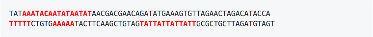

# 1. Answers

This pdf document contains solutions for questions asked as part of the "Genome Annotation" module.

# 2. Answers for 'Comparing Reference Genomes':

**Question: Based on your work during the previous assembly module, can you think of a reason why assembly might not be perfect?**

There are many possible answers here (refer to slides 3 & 4 from the assembly presentation), including:

1. Repetitive sequences.
2. Low sequencing depth.
3. Errors in reads

**Question: Is there an obvious issue with our assembly?**

Yes, the 3' end of our assembly is missing!

**Question: Why do you think both ends of the reference genome align to the same part of our assembled genome?**

Both ends of a chromosome have telomeres, which contain identical sequence.

**Questions: What do you think the green segments represent in this image?**

Inversions – pieces of the genome that are in the opposite direction when compared between isolates.

**Question: Why is the red line not centered in the plot and moves up or down?**

Some pieces of the genome are missing from one isolate to another, meaning the align at different places.

# 3. Answers for 'Identifying Repetitive DNA':

Below are the repetitive sequences in <t style="color:red"><b>BOLD RED</b></t>:



**Question: Why do the sections “Retroelements” and “DNA transposons” all have zeros?**

_Plasmodium_ species do not have transposons.

**Question: Approximately what proportion of our genome assembly was masked?**

We can look at the file `PB.contigs.polished.reheader.fasta.tbl` using a command like `less`, `more`, or `cat`. You
should see a table similar to the following image:


From here you can see that ~17% of the genome was masked (Simple repeats + Low complexity).

# 4. Answers for 'Finding Genes':

**Question: How many exons does the gene “1_g” have?**

Looking at the output of the `head` command you can see that '1_g' has *4* exons. To get this answer, you can also try
the more expert-level command:

> ```commandLine
> grep "\"1_g\"" genemark.gtf | grep exon | wc -l
> ```

This command should print `4` on the command line. The two `\"` in the command above tell `grep` to look for quotation
marks as part of the search. The `\` is what is known as an "escape character".

**Question: Can you think of a simple LINUX command to figure out how many genes GeneMark-ES identified?**

There are multiple solutions to this question – ask your instructor if how you found the solution is acceptable. One
possible solution is to use the tool `awk` like below:

> ```commandLine
> awk '{print $10}' genemark.gtf | uniq | wc -l
> ```

This command works by:

1. Printing the 10th column (`awk '{print $10}'`; "$10" is the column with gene_id).
2. *PIPING* the output of `awk` to the next command, `uniq`
3. `uniq` finds all _unique_ values
4. *PIPING* the output of `uniq` to the next command, `wc`
5. `wc -l` tells you how many lines are printed by the previous command.

To see each step in this command, try running each of the above without the next pipe, like so:

1. `awk '{print $10}' genemark.gtf`
2. `awk '{print $10}' genemark.gtf | uniq`
3. `awk '{print $10}' genemark.gtf | uniq | wc -l`

**Question: How many genes did GeneMark find?**

You can use the above command to find out. The answer should be close to 300 Genes.

**Question: What is the part of the command 2> /dev/null actually doing?**

Directing (also known as "piping") anything to `/dev/null` means you are directing any output to an empty file that is
not actually record

**Question: How many genes are in our final set of possible genes (bonafide.gb)?**

This requires you to come up with another command by using some abstract problem-solving. If you look at the bonafide.gb
file like so:

> ```commandLine
> more bonafide.gb
> ```

You may notice that for each gene record, there is a single "LOCUS" line. We can use that to find out how many genes
were found:

> ```commandLine
> grep -c LOCUS bonafide.gb
> ```

the `-c` flag counts the number of times LOCUS was found within the file `bonafide.gb`

**Question: What do you think a limitation of using just 1 chromosome to train our gene finder is?**

The main limitation is the number of genes that we can use for training. As we are only using 1 chromosome to train
AUGUSTUS, there are only ~300 genes that can be used for training. If we use all chromosomes, that means we can use all
possible genes in the entire genome (~5,300 genes).

**Question: Can you figure out how many genes each approach found?**

We can use a similar command as the previous question where we found the number of genes in `bonafide.gb`:

> ```commandLine
> grep -c 'start gene' PB.contigs.default.gff
> ```

Since each gff file contains one 'start gene' entry per found gene, we can use `grep` to count the total number of
identified genes. This should give a value of approximately 300-320 genes for each file.

**Question: We identified protein coding genes, but can you think of any other types of annotations we
could find with Augustus?**

If you read the AUGUSTUS paper, you can also identify: UnTranslated Regions (UTRs) and Processed pseudogenes.

**Question: How many exons does this gene have?**

See the below figure:


This gene has 4 exons.

**Question: How do the predictions for your model versus the default model compare?**

The default model uses an alternative splice site for one of the exons.

**Question: What are both predictions missing, and why do you think that is?**

They are both missing UTRs. That is because we did not tell AUGUSTUS to search for them.

**Question: How many exons does this gene have?**

It has 8 exons.

**Question: How many introns?**

It has 7 introns.

**Question: How can you extract the same information for another gene by modifying the above command? Report the command
and result here.**

You can just change "g54" to any other gene number and then modify the number given to -A to change the number of lines.
An example for another gene (g53) is:

> ```commandLinecommandLine
> grep -A 15 "start gene g53" PB.contigs.gff
> ```

# 5. Answers for 'Using Comparative Genomes to Identify Genes':

**Question: What is difficult about this alignment?**

It has an intron.

**Question: Did you notice something at the end of the alignment that was not in the protein sequence?**

The stop codon "TAG".

**Question: What was difficult in this example?**

There is a mutation in the DNA sequence that caused a different amino acid to be in the sequence. The sequence
changed from GCA to GGA.

**Question: Do you think this is an issue, or is there something biology-related going on?**

Changes in DNA sequence occur all the time between species. The change in amino acid could reflect some selective
advantage for a given species or be neutral and confer no evolutionary advantage.

**Question: What do you think the * character represents?**

It is the symbol the stop codon.

**Question: What is the gene that we identified in IGV?**

Myosin B

**Question: Can you name a function of this gene and how did you get the answer?**

Myosins are motor proteins that are used for motility via binding of actin chains in eukaryotes. There are a number of
resources where this information can be found, including the UCSC genome browser, Uniprot, and _even_ Wikipedia – ;D.
